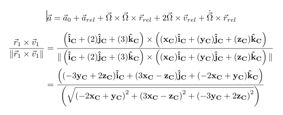

# Vector Expressions for Sympy

## Motivation

With Sympy we can write general symbolic expression by using symbols, functions, numbers,...., which are instances of the class `Expr`.

Similarly, we can write symbolic matrix expression using instances of the class `MatrixExpr`. We can also substitute dense or sparse matrices into those symbolic expressions.

Unfortunately, vector expressions (involving dot and cross products, magnitude, divergence, curl, ...) are not implemented yet. This is a highly experimental module to implement **vector expressions**. At the moment, only basic functionalities and printing are implemented. Take a look at the Jupyter notebook **Tutorial** to learn how to use it. Also, feel free to help with the development.

## TODO

* Operation precedence.
* Fix VecAdd, read the comments in the code to understand the problem.
* Printing need some works, especially VecMul. For example, `(v1 & v2) * (v1 ^ v2)` looks unintuitive.
* Rules of expansion, collection, simplification.
* General derivatives of vector expressions.
* Solve for vector expressions.
* Gradient: the gradient of a scalar field is a vector; the gradient of a vector field is a tensor (matrix). Is it possible to implement them in this module? Is it possible to integrate them with tensor and linear algebra modules?